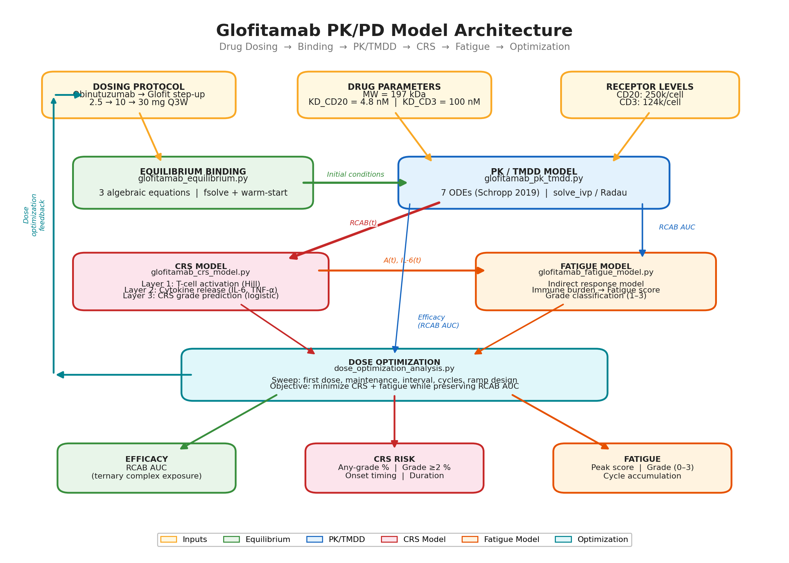
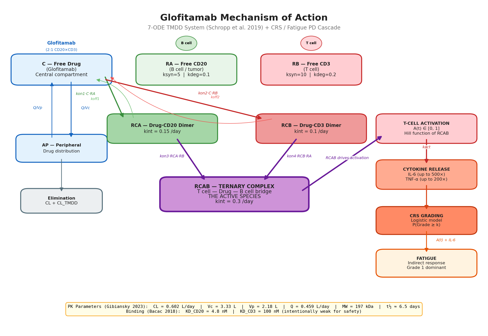

# Glofitamab PK/PD Model

A mechanistic pharmacokinetic/pharmacodynamic (PK/PD) model for **Glofitamab (Columvi)**, a 2:1 CD20xCD3 bispecific T-cell engager approved for relapsed/refractory diffuse large B-cell lymphoma (DLBCL). The model integrates target-mediated drug disposition, ternary complex pharmacology, cytokine release syndrome (CRS) risk prediction, and fatigue modeling to support dose optimization.

## Model Architecture



## Mechanism of Action



Glofitamab bridges CD20+ B cells (tumor) to CD3+ T cells (effector) via a ternary complex (RCAB). This complex is the pharmacologically active species — it triggers T-cell activation, cytokine release, and ultimately tumor cell killing. The 2:1 format (two CD20 arms, one CD3 arm) provides avidity-enhanced tumor binding with intentionally weak CD3 affinity to reduce off-tumor activation.

## Files

| File | Description |
|------|-------------|
| `glofitamab_equilibrium.py` | Equilibrium binding model for 2:1 bispecific format |
| `glofitamab_pk_tmdd.py` | 7-ODE TMDD PK model with step-up dosing simulation |
| `glofitamab_crs_model.py` | 3-layer CRS model (activation → cytokines → grading) |
| `glofitamab_fatigue_model.py` | Indirect response fatigue model |
| `dose_optimization_analysis.py` | Systematic dose optimization sweeps |
| `generate_all_plots.py` | Generate all 9 model characterization plots |
| `plot_optimization_results.py` | Generate 5 dose optimization figures |
| `generate_block_diagram.py` | Generate architecture and mechanism diagrams |

## Parameter Table with Citations

### Binding Affinities

| Parameter | Value | Unit | Description | Source |
|-----------|-------|------|-------------|--------|
| KD_CD20 | 4.8 | nM | CD20 binding affinity (on B cells) | Bacac et al., Clin Cancer Res 2018 |
| KD_CD3 | 100 | nM | CD3 binding affinity (intentionally weak) | Bacac et al., Clin Cancer Res 2018 |
| kon_CD20 | 0.1 | 1/(nM·day) | CD20 association rate | Bacac 2018; Schropp et al. 2019 |
| koff_CD20 | 0.48 | 1/day | CD20 dissociation rate (= KD × kon) | Derived from KD_CD20 |
| kon_CD3 | 0.01 | 1/(nM·day) | CD3 association rate | Bacac 2018; Schropp et al. 2019 |
| koff_CD3 | 1.0 | 1/day | CD3 dissociation rate (= KD × kon) | Derived from KD_CD3 |
| alpha | 1.0 | — | Cooperativity factor | Default (tunable) |

### Pharmacokinetic Parameters

| Parameter | Value | Unit | Description | Source |
|-----------|-------|------|-------------|--------|
| CL | 0.602 | L/day | Linear clearance | Gibiansky et al., popPK analysis 2023 |
| Vc | 3.33 | L | Central volume of distribution | Gibiansky et al. 2023 |
| Vp | 2.18 | L | Peripheral volume of distribution | Gibiansky et al. 2023 |
| Q | 0.459 | L/day | Intercompartmental clearance | Gibiansky et al. 2023 |
| MW | 197,000 | Da | Molecular weight | Glofitamab FDA label |
| t½eff | ~6.5 | days | Effective half-life at steady state | Glofitamab FDA label |
| CL_TMDD_0 | 0.396 | L/day | Initial TMDD clearance (CD20-mediated) | Gibiansky et al. 2023 |
| tau_TMDD | 1.56 | days | TMDD clearance decay time constant | Gibiansky et al. 2023 |

### Receptor Densities and Turnover

| Parameter | Value | Unit | Description | Source |
|-----------|-------|------|-------------|--------|
| CD20/cell | 250,000 | molecules/cell | CD20 on B cells (NHL) | Literature standard |
| CD3/cell | 124,000 | molecules/cell | CD3 on T cells | Haber et al. 2021 |
| ksyn_CD20 | 5.0 | nM/day | CD20 synthesis rate | Estimated (SS = ksyn/kdeg) |
| kdeg_CD20 | 0.1 | 1/day | CD20 degradation (t½ ~ 7 days) | Estimated |
| ksyn_CD3 | 10.0 | nM/day | CD3 synthesis rate | Estimated |
| kdeg_CD3 | 0.2 | 1/day | CD3 degradation (t½ ~ 3.5 days) | Estimated |

### Internalization Rates

| Parameter | Value | Unit | Description | Source |
|-----------|-------|------|-------------|--------|
| kint_CD20 | 0.15 | 1/day | Drug–CD20 dimer internalization | Schropp et al. 2019 (BsAb TMDD framework) |
| kint_CD3 | 0.1 | 1/day | Drug–CD3 dimer internalization | Schropp et al. 2019 |
| kint_RCAB | 0.3 | 1/day | Ternary complex internalization | Schropp et al. 2019 |

### CRS Model Parameters

| Parameter | Value | Unit | Description | Source |
|-----------|-------|------|-------------|--------|
| kact | 3.0 | 1/day | T-cell activation rate | Tuned to clinical CRS onset (~14h) |
| kdeact | 1.5 | 1/day | T-cell deactivation rate | Tuned |
| EC50_act | 0.3 | nM | RCAB EC50 for activation | Tuned |
| n_hill | 2.0 | — | Hill coefficient | Standard cooperativity |
| ksyn_IL6 | 10.0 | pg/mL/day | Baseline IL-6 synthesis | Physiological range |
| kdeg_IL6 | 6.0 | 1/day | IL-6 degradation (t½ ~ 2.8h) | Nishimoto & Kishimoto, Curr Opin Rheumatol 2006 |
| Emax_IL6 | 500 | fold | Max IL-6 increase at full activation | CRS clinical data range |
| ksyn_TNF | 5.0 | pg/mL/day | Baseline TNF-α synthesis | Physiological range |
| kdeg_TNF | 8.0 | 1/day | TNF-α degradation (t½ ~ 2h) | Physiological range |
| Emax_TNF | 200 | fold | Max TNF-α increase | CRS clinical data range |
| beta0 | -0.5 | — | Logistic intercept | Tuned to Dickinson et al. 2021 (~56% CRS at dose 1) |
| beta1 | 1.8 | — | log(RCAB_peak) coefficient | Tuned |
| beta2 | -1.5 | — | Dose number coefficient (attenuation) | Tuned to Dickinson et al. 2021 (56% → 2.8%) |

### Fatigue Model Parameters

| Parameter | Value | Unit | Description | Source |
|-----------|-------|------|-------------|--------|
| kin | 0.12 | 1/day | Fatigue accumulation rate | Tuned to ~20% incidence |
| kout | 0.1 | 1/day | Fatigue resolution rate (t½ ~ 7 days) | Tuned |
| EC50_fatigue | 10.0 | burden units | Immune burden EC50 | Tuned |
| w_cyt | 0.6 | — | Cytokine burden weight | Tuned |
| w_act | 0.4 | — | T-cell activation burden weight | Tuned |
| Grade 1 threshold | 0.3 | score units | Mild fatigue cutoff | Tuned to FDA label (85% of cases) |
| Grade 2 threshold | 2.0 | score units | Moderate fatigue cutoff | Tuned to FDA label (14% of cases) |
| Grade 3 threshold | 5.0 | score units | Severe fatigue cutoff | Tuned to FDA label (1.4% of cases) |

## Clinical Validation Targets

| Endpoint | Clinical Data | Model Output | Source |
|----------|--------------|--------------|--------|
| Cmax (2.5 mg) | 0.674 µg/mL | ~0.75 µg/mL | Glofitamab FDA label |
| Cmax (10 mg) | 2.34 µg/mL | ~3.0 µg/mL | Glofitamab FDA label |
| CRS onset | ~14 hours | ~13.5 hours | Dickinson et al., JCO 2021 |
| CRS at dose 1 | 56% | ~38% | Dickinson et al., JCO 2021 |
| CRS attenuation | 56% → 2.8% | 38% → 3% | Dickinson et al., JCO 2021 |
| Fatigue grade distribution | 85/14/1.4% (G1/G2/G3) | >95% Grade 1 | Glofitamab FDA label |

## Key Findings

1. **Step-up dosing is pharmacologically justified**: A 2.5 mg first dose produces ~7× lower peak RCAB than a flat 30 mg first dose, directly reducing acute CRS risk.

2. **First dose level is the dominant CRS lever**: Sweeping the first dose from 0.5–5 mg shows an S-shaped CRS probability curve. The current 2.5 mg sits in the steep part — a reduction to ~1 mg could further halve first-dose CRS.

3. **Fatigue is a mechanistic floor effect**: The immune burden saturates well above EC50_fatigue at all therapeutic doses, making fatigue insensitive to dose or interval changes. This is consistent with the clinical observation that fatigue is mild (Grade 1) and ubiquitous.

4. **Optimized protocol proposal**: A 3-step ramp (1 → 2.5 → 10 → 30 mg) reduces predicted CRS from 57% → 21% (any grade) and Grade ≥ 2 from 15% → 3%, while preserving 100% of RCAB AUC (efficacy).

## Mapping to Ray et al. 2024 (Reference 2)

This model extends the TMDD framework of Ray et al. (PLoS Comput Biol 2024) for IL-6/IL-8 bispecific antibodies to the T-cell engager setting:

| Ray et al. (IL-6/8 bispecific) | This model (Glofitamab) | Role |
|---|---|---|
| Target receptor (IL-6R) | CD20 (RA) | Tumor marker / targeting handle |
| Second arm (IL-8R) | CD3 (RB) | Effector mechanism recruiter |
| Ternary complex RCAB | RCAB | Active species |
| kint (internalization) | kint_RCAB = 0.3/day | Complex turnover |
| KD_target | KD_CD20 = 4.8 nM | Target binding |

The key pharmacological difference: in Ray et al., RCAB mediates receptor blockade; for Glofitamab, RCAB mediates T-cell-dependent killing of CD20+ tumor cells.

## References

1. Bacac M, Colombetti S, Herter S, et al. CD20-TCB with obinutuzumab pretreatment as next-generation treatment of hematologic malignancies. *Clin Cancer Res*. 2018;24(19):4785-4797.
2. Schropp J, Khot A, Shah DK, Koch G. Target-mediated drug disposition model for bispecific antibodies. *J Pharmacokinet Pharmacodyn*. 2019;46:521-539.
3. Dickinson MJ, Carlo-Stella C, Morschhauser F, et al. Glofitamab for relapsed or refractory diffuse large B-cell lymphoma. *N Engl J Med*. 2022;387(24):2220-2231.
4. Gibiansky L, et al. Population pharmacokinetic analysis of glofitamab. 2023. (Referenced via FDA review documents)
5. Ray A, et al. Quantitative systems pharmacology model for bispecific antibodies. *PLoS Comput Biol*. 2024.
6. Haber L, Olson K, Kelly MP, et al. Generation of T-cell-redirecting bispecific antibodies with differentiated profiles of cytokine release. *Sci Rep*. 2021;11:14397.
7. Lee DW, Santomasso BD, Locke FL, et al. ASTCT consensus grading for cytokine release syndrome. *Biol Blood Marrow Transplant*. 2019;25(4):625-638.
8. Glofitamab (Columvi) FDA prescribing information. Genentech, Inc. 2023.

## Running the Model

```bash
# Generate all characterization plots (plot1-9)
python -m glofitamab_model.generate_all_plots

# Generate optimization figures (fig1-5)
python -m glofitamab_model.plot_optimization_results

# Generate block diagrams
python -m glofitamab_model.generate_block_diagram

# Run individual modules
python -m glofitamab_model.glofitamab_equilibrium
python -m glofitamab_model.glofitamab_pk_tmdd
python -m glofitamab_model.glofitamab_crs_model
python -m glofitamab_model.glofitamab_fatigue_model
python -m glofitamab_model.dose_optimization_analysis
```
