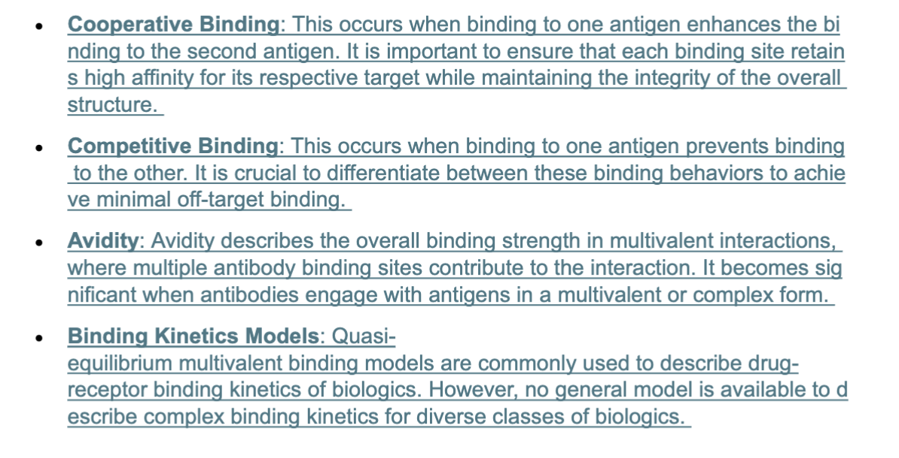

Inspired by this paper:
Mechanistic computational modeling of monospecific and bispecific antibodies targeting interleukin-6/8 receptors

References:
1. https://journals.plos.org/ploscompbiol/article?id=10.1371/journal.pcbi.1012157
2. https://www.frontiersin.org/journals/bioengineering-and-biotechnology/articles/10.3389/fbioe.2024.1352014/full